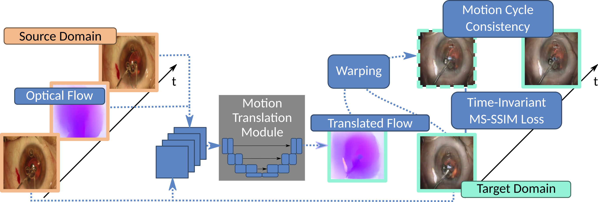

# Temporally Consistent Sequence-to-Sequence Translation of Cataract Surgeries

This is the official code repository for *Temporally Consistent Sequence-to-Sequence Translation of Cataract Surgeries*



## Setup

* Install a virtual environment (e.g. conda or venv)
* Install the required external packages with ```pip install -r requirements.txt```
* Install the custom repository package with ```pip install -e .```

## Training 

* The training scripts for each method used in the paper can be found in ```scripts/train/```

## Inference

* Evaluation scripts can be found in ```scripts/eval/```

## Example Results


## How-to Cite

If you use our research or the resources within this repository,
please consider citing our work. Below is the recommended citation:

### APA (American Psychological Association) Style:

```swift
Frisch, Y., Fuchs, M., & Mukhopadhyay, A. (2023).
Temporally consistent sequence-to-sequence translation of cataract surgeries.
International Journal of Computer Assisted Radiology and Surgery, 1-8.
```

### BibTeX (for LaTeX users):

```bibtex
@article{frisch2023temporally,
  title={Temporally consistent sequence-to-sequence translation of cataract surgeries},
  author={Frisch, Yannik and Fuchs, Moritz and Mukhopadhyay, Anirban},
  journal={International Journal of Computer Assisted Radiology and Surgery},
  pages={1--8},
  year={2023},
  publisher={Springer}
}
```